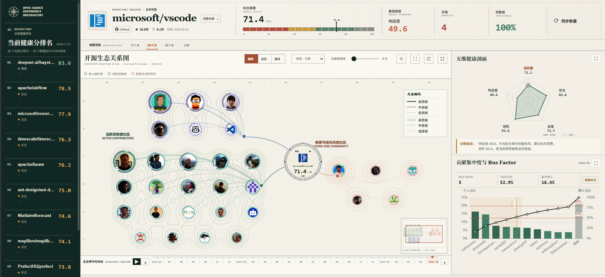
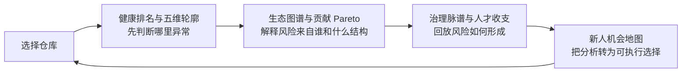
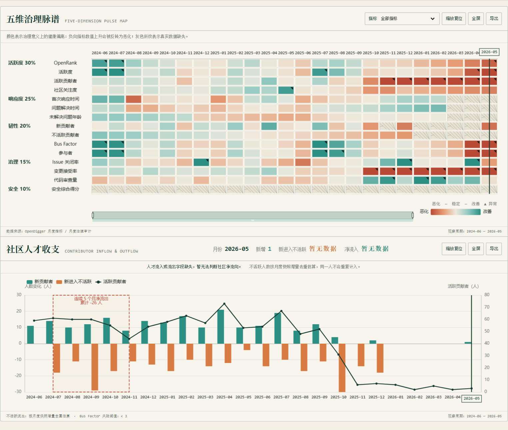
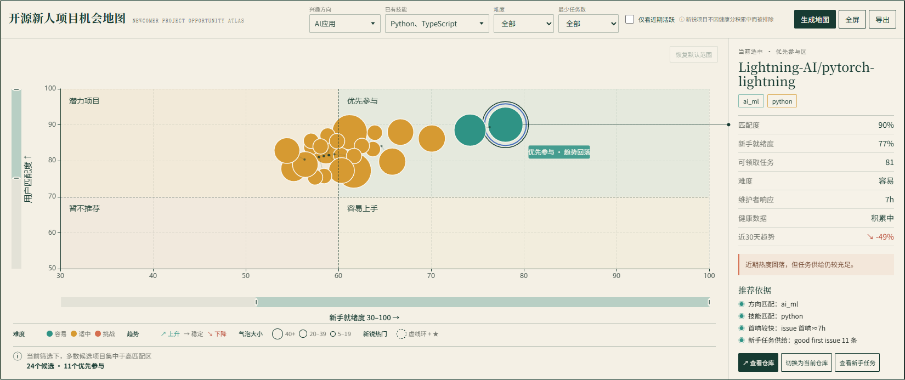
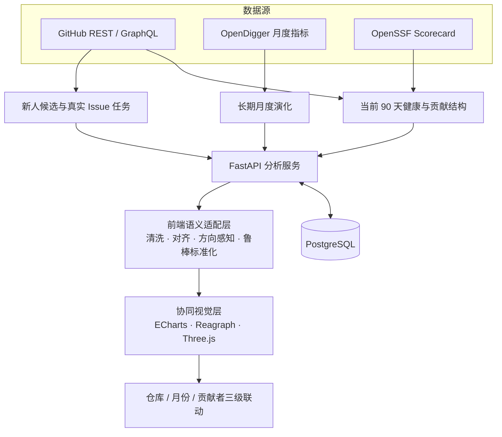

# OpenSage

[](https://www.python.org/)
[](LICENSE)
[](https://react.dev/)
[](https://vite.dev/)
[](https://echarts.apache.org/)
[](https://reagraph.dev/)
[](https://fastapi.tiangolo.com/)
[](https://www.postgresql.org/)
[](https://opendigger.cn/)
[](https://docs.github.com/en/rest)

> **信息可视化课程期末作品**
> OpenSage 将开源社区的健康状态、贡献结构与新人机会，转译为可探索、可联动、可追溯的视觉分析系统。

## 目录

- [评审速览](#评审速览)
- [1. 作品概览](#1-作品概览)
- [2. 与课程评分要求的对应关系](#2-与课程评分要求的对应关系)
- [3. 信息叙事：从“看见”到“行动”](#3-信息叙事从看见到行动)
- [4. 核心可视化一：健康与生态结构](#4-核心可视化一健康与生态结构)
- [5. 核心可视化二：社区健康的时间演化](#5-核心可视化二社区健康的时间演化)
- [6. 核心可视化三：新人机会地图](#6-核心可视化三新人机会地图)
- [7. 数据分析与指标口径](#7-数据分析与指标口径)
- [8. 视觉设计语言](#8-视觉设计语言)
- [9. 技术架构与实现完整性](#9-技术架构与实现完整性)
- [10. 本地运行](#10-本地运行)
- [11. 项目结构](#11-项目结构)
- [12. 成果与演进](#12-成果与演进)
- [13. License](#13-license)



## 评审速览

| 作品证据 | 已实现内容 |
|---|---|
| **7 类互补视图** | 健康排名、生态关系图谱、五维雷达、贡献 Pareto、治理脉谱、人才收支、新人机会地图 |
| **3 级跨图联动** | 仓库、月份、贡献者三个分析粒度共享状态，而非彼此孤立的图表 |
| **2 种时间语义** | 近 90 天当前证据快照与 OpenDigger 长期月度演化明确分离 |
| **1 条完整视觉叙事** | 总览判断 → 结构诊断 → 时间回放 → 风险定位 → 行动选择 |
| **可信数据表达** | 缺失值不伪装为 0，不生成模拟趋势；异常、阈值和代理数据均显式标注 |
| **可复现工程质量** | 本次交付校验中，核心视觉数据测试 **24/24 通过**，类型检查与生产构建通过 |

## 1. 作品概览

### 1.1 为什么做 OpenSage

开源项目的数据散落在 GitHub、OpenDigger、OpenSSF 等来源中。单看指标表，很难回答真正的治理问题：

- 项目现在是否健康？哪个维度正在拖累整体状态？
- 贡献是否过度集中在少数核心成员，离开一人会不会形成风险？
- 社区在吸引新人，还是持续流失人才？风险从哪个月开始积累？
- 对一个具体新人而言，哪个项目既匹配兴趣与技能，又真的准备好了可执行任务？

OpenSage 面向项目维护者、技术决策者、企业 OSPO 与开源新人，把离散指标组织成一条**从证据到行动的可视化分析路径**。课程版的重心不是“做一个功能很多的网站”，而是让数据关系、变化和不确定性都能被看见、比较和解释。

### 1.2 设计目标

1. **先总览，再下钻**：从仓库排名和五维健康轮廓进入贡献结构与指标证据。
2. **同时看关系与时间**：既观察“谁与谁有关”，也追踪“何时发生变化”。
3. **用语义驱动编码**：颜色表达治理改善/恶化，尺度变换匹配数据分布，缺失值保留真实语义。
4. **让图表支持决策**：每个视图都能筛选、联动、定位证据或进入下一步行动。

## 2. 与课程评分要求的对应关系

| 评分维度 | OpenSage 的对应证据 |
|---|---|
| **数据分析与信息叙事（20）** | 整合 GitHub、OpenDigger、OpenSSF；完成清洗、派生比例、快照去重、方向感知和鲁棒标准化；以“总览—诊断—演化—行动”组织叙事 |
| **可视化设计（20）** | 针对排名、关系、构成、时间变化和机会选择分别采用火花线、关系图谱、雷达/Pareto、热力图/组合图、四象限气泡图；视觉通道均有明确语义 |
| **交互设计（15）** | 仓库/月/贡献者三级联动，时间轴播放、缩放、筛选、搜索、邻域高亮、详情下钻、全屏、导出与键盘操作 |
| **技术实现与完整性（15）** | React + ECharts custom series + Reagraph/Three.js + FastAPI + PostgreSQL；真实数据接入，包含加载、空、错误与降级状态，并完成测试、类型检查和生产构建 |
| **创新与综合表现（10）** | 将关系网络、治理脉谱、人才流动和新人机会统一进协同分析台；突出缺失数据语义、方向感知颜色和可解释证据，而非只追求视觉装饰 |
| **5 分钟展示（20）** | README 提供一条可直接照着演示的 5 分钟路线，三张当前版本截图覆盖作品的完整叙事 |

> 评分表强调“信息可视化能力，而非单纯 Web 开发”。因此下文每个核心视图都按照 **用户问题 → 视觉编码 → 交互 → 可获得洞察** 来说明。

## 3. 信息叙事：从“看见”到“行动”



这不是七张图的简单堆叠，而是一套协同视图：

- **仓库级联动**：在排名、搜索或机会地图中切换仓库，整页分析上下文同步刷新。
- **月份级联动**：生态图谱、治理脉谱和人才收支共享所选月份；缩放时间范围时两张时序图同步。
- **贡献者级联动**：生态图谱与 Pareto 图共享选中/悬停贡献者，关系位置与贡献集中度可以相互验证。

## 4. 核心可视化一：健康与生态结构


### 4.1 健康排名与趋势火花线

- **用户问题**：哪些仓库更健康？当前仓库处在什么位置？
- **视觉编码**：排名位置表达横向比较，健康分表达当前状态，小型趋势线提供近期方向线索。
- **交互**：搜索并切换仓库；选择结果会成为全页统一分析对象。
- **洞察**：先发现值得关注的对象，再进入结构和时间维度解释原因。

### 4.2 WebGL 生态关系图谱

- **用户问题**：核心贡献者、活跃成员、新人、风险成员和关联仓库如何构成一个生态？
- **视觉编码**：节点颜色编码角色；贡献者节点半径采用平方根缩放，仓库节点采用对数缩放；边宽与透明度编码关系强度。非线性尺度避免头部节点“吞没”长尾成员。
- **交互**：结构/社区/路径三种观察模式，角色筛选、贡献阈值、搜索、时间轴播放、事件标记、节点选择、邻域高亮、详情抽屉、关联仓库展开、拖拽、视图适配、缩略图和全屏。
- **洞察**：从“贡献集中”继续追问“集中在谁、处于哪个角色、与哪些仓库相连”，把抽象指标还原成可解释的关系结构。

> 图谱采用稳定的叙事布局与 2.5D WebGL 渲染，重点是可读性和跨视图分析，并不将规则分组夸大为社区发现算法。

### 4.3 五维健康雷达

- **用户问题**：健康分为什么高或低？最强项和短板分别是什么？
- **视觉编码**：同一坐标系叠加当前值与基准虚线，多层刻度呈现差距；标签同时展示分数和相对差值。
- **交互**：点击维度点或标签，展开指标含义、公式、组成项和权重；支持 Enter/Space 打开、Esc 关闭和焦点恢复。
- **洞察**：综合分不再是一个黑箱数字，评审者可以从图形直接定位短板并追溯计算证据。

### 4.4 贡献者 Pareto 与 Bus Factor

- **用户问题**：项目是否依赖少数成员？贡献长尾是否健康？
- **视觉编码**：柱形表示个人贡献占比，折线表示累计占比，50%/80% 参考线与 Bus Factor 竖线标记集中程度；角色颜色与生态图谱保持一致。
- **交互**：悬停或点击贡献者，会在生态图谱中同步突出对应节点。
- **洞察**：同时读取最大单人占比、Top 5 占比、达到累计 50% 所需人数和长尾结构，比只展示一个 Bus Factor 更完整。

## 5. 核心可视化二：社区健康的时间演化



### 5.1 五维治理脉谱

- **用户问题**：哪个指标在何时开始改善或恶化？变化是正常波动、异常点还是阈值违规？
- **图形选择**：以“指标 × 月份”的矩阵同时承载多维、长时序比较，比多条折线叠加更适合发现阶段性模式。
- **语义编码**：红色表示治理恶化，中性色表示稳定，青绿色表示改善。响应时长等负向指标先反转方向，所以颜色表达的是**治理意义**，而不是原始数值大小。
- **不确定性表达**：缺失值使用灰色斜纹，异常值使用三角标记，阈值违规使用橙色边框；即使不依赖颜色，也能区分状态。
- **交互**：维度聚焦、时间缩放、月份选择、悬停证据、全屏与 PNG 导出。Tooltip 同时给出原值、中位数、相对变化、标准化偏差、来源及派生公式。

### 5.2 社区人才收支

- **用户问题**：社区是在持续吸纳新人，还是出现人才流失和关键人风险？
- **视觉编码**：新增贡献者为正向柱，首次转为不活跃的贡献者为负向柱，活跃贡献者总数为折线；不同量纲使用双轴。
- **风险叙事**：背景区间标记低 Bus Factor，虚线范围标记连续至少 3 个月的净流出，并自动强调最严重区间。
- **联动**：与治理脉谱共享时间窗口和所选月份，可把“某月指标异常”与“同月人才变化”并排验证。

## 6. 核心可视化三：新人机会地图



- **用户问题**：对当前新人而言，哪个项目既适合自己，又提供了足够清晰、真实、近期可参与的任务？
- **空间编码**：横轴为项目的新人准备度，纵轴为用户匹配度，四象限划分“优先参与 / 潜力项目 / 容易上手 / 暂不推荐”。
- **气泡编码**：气泡面积表示可领取任务数，颜色表示任务难度；选中态使用双环。若数据提供新锐标记，则以辅助环与星标强化识别。
- **减少遮挡**：自定义渲染执行确定性的气泡避碰；移动后的气泡用引导线连接真实坐标，既提高可读性，也不篡改数据位置。
- **交互与证据**：支持兴趣、技能、难度、最少任务数、近期活跃和双轴范围筛选；点击项目查看推荐理由与真实 Issue 任务，并可切换为当前仓库继续分析。支持键盘切换、全屏和图片导出。

推荐不是一个不可解释的列表，而是一张可比较、可筛选、能说明“为什么推荐”的决策地图。

## 7. 数据分析与指标口径

### 7.1 数据来源

| 数据源 | 用途 | 在视觉中的位置 |
|---|---|---|
| **GitHub REST / GraphQL** | 近 90 天活动、Issue/PR 响应、贡献结构、成员与真实任务 | 当前健康、生态图谱、Pareto、新人任务 |
| **OpenSSF Scorecard** | 开源安全实践证据 | 当前健康的安全维度 |
| **OpenDigger** | 长期月度指标与历史快照 | 治理脉谱、人才收支、时间轴下钻 |
| **PostgreSQL** | 仓库目录、指标、历史快照和分析结果 | 支撑跨视图一致的数据上下文 |

### 7.2 双时间尺度，避免“同名指标混用”

OpenSage 明确区分两类分析口径：

- **当前状态 `current-v1`**：基于最近 90 天 GitHub 证据与 OpenSSF，服务于当前健康卡片和排名。
- **历史月度演化**：基于 OpenDigger 月度数据，服务于趋势、脉谱、人才流动和时间下钻。

历史序列不会被当前口径回填，也不会拿日级演示数据冒充月度趋势。两条时间线来源不同、用途不同，页面保留各自的版本和缺失语义。

### 7.3 五维健康模型

当前健康由五个互补维度构成：

$$
Health = 0.30\,Activity + 0.25\,Responsiveness + 0.20\,Resilience + 0.15\,Governance + 0.10\,Security
$$

| 维度 | 回答的问题 | 当前权重 |
|---|---|---:|
| 活跃度 Activity | 社区是否持续产生有效活动？ | 30% |
| 响应力 Responsiveness | Issue/PR 是否得到及时反馈和处理？ | 25% |
| 韧性 Resilience | 贡献是否分散，关键人风险是否可控？ | 20% |
| 治理 Governance | 协作规则、文档和流程是否清晰？ | 15% |
| 安全 Security | 项目是否具备基本安全实践？ | 10% |

只有五维均可计算且整体证据完整度不低于 80% 时，系统才给出综合健康分；否则保留为空并说明证据不足。详细口径见 [current-v1 健康分模型](knowledge_base/Health_Score_Algorithm_Current_V1.md) 与 [指标字典](knowledge_base/Metric_Dictionary.md)。

### 7.4 鲁棒变化检测与派生指标

治理脉谱优先使用可比较的标准化分数；缺少标准化结果时，采用基于中位数与 MAD 的鲁棒偏差：

$$
z_{robust}=0.6745\times\frac{x-\operatorname{median}(x)}{MAD}
$$

- 当 MAD 退化为 0 时回退到标准差，避免除零和错误放大。
- 负向指标先反转方向，保证“改善始终同色、恶化始终同色”。
- 派生比例仅在分母有效时计算；缺失继续保持 `null`。
- 不活跃成员快照转换为“本月首次新增不活跃人数”，避免同一成员被逐月重复计算。
- `|z| ≥ 2.5` 作为异常提示，并与业务阈值违规分开编码。

### 7.5 新人机会评分

新人地图的坐标来自两个可解释分量，而不是直接输出一个排序数字：

$$
Opportunity = 0.55\times Fit + 0.45\times Readiness
$$

- **Fit** 综合兴趣领域、技术栈与关键词匹配。
- **Readiness** 综合响应效率、近期活跃、任务供给和入门文档。
- 当部分证据缺失时，只在可用项之间动态重分权重，并向界面保留不确定性。

完整方法见 [新人推荐算法（当前版）](knowledge_base/Recommendation_Algorithm_Current.md)。

### 7.6 数据可信原则

1. **`null` 不等于 0**：0 是低表现，`null` 是证据不足，两者在计算和视觉上完全分开。
2. **不生成假趋势**：历史不足时展示空状态或降级说明，不用插值曲线制造“完整感”。
3. **代理数据有标记**：当生态关系使用 activity proxy 等替代证据时，元数据和说明中保留来源。
4. **结果可以追溯**：维度详情、Tooltip 和任务抽屉呈现来源、公式、阈值或原始链接。

这套原则让“不确定”也成为信息，而不是被界面悄悄隐藏。

## 8. 视觉设计语言

### 8.1 “治理图鉴”配色

| 颜色 | 含义 | 典型用途 |
|---|---|---|
| 米白 `#F4F0E5` / `#F8F5EC` | 纸张式分析背景 | 降低大面积高饱和色带来的疲劳 |
| 深绿 `#173B32` | 主信息与结构 | 标题、坐标、关键轮廓 |
| 青绿 `#2B8F83` | 改善、健康、流入 | 正向变化与稳定增长 |
| 红棕 `#B84935` | 恶化、风险、流出 | 负向变化与风险区间 |
| 橙色 `#D77B43` | 警示、阈值 | 阈值违规与需要关注的状态 |

颜色从不单独承担判断：斜纹、三角、边框、双环、参考线和文字说明提供冗余编码，兼顾色觉差异与黑白输出。

### 8.2 可读性与无障碍

- 平方根/对数尺度压缩长尾数据，让头部与普通节点可以同时被看见。
- 响应式断点适配桌面和较窄屏幕，关键图表可进入全屏。
- 交互元素提供 ARIA 标签、键盘导航、焦点恢复和 `prefers-reduced-motion` 支持。
- 导出的图表补充标题、来源和时期，并以高像素比例输出，适合汇报材料。

## 9. 技术架构与实现完整性



| 层次 | 技术与职责 |
|---|---|
| 视觉层 | React 19、ECharts 6 custom series、Reagraph、Three.js；负责关系图谱、自绘单元格、气泡避碰和交互联动 |
| 数据适配层 | 月份对齐、派生比例、方向反转、MAD 标准化、异常判断、快照去重和缺失值保真 |
| 分析服务层 | FastAPI；当前健康、历史月度、生态关系、新人评分、仓库导入等接口 |
| 数据层 | PostgreSQL；保存仓库、指标、快照、任务与分析结果 |

工程上还包含：

- 生态图谱懒加载，限制节点/边规模，并缓存布局与纹理，避免重型视图阻塞首屏。
- 异步请求使用取消与请求序号控制，防止快速切仓库时旧响应覆盖新状态。
- 图表使用 `ResizeObserver` 适配容器；数据不足时提供加载、空、错误和降级状态。
- 2026-07-24 本次交付校验：核心前端视觉数据测试 **24/24 通过**，`npm run typecheck` 与 `npm run build` 均通过。


## 10. 本地运行

### 10.1 环境要求

- Docker Desktop（启动 PostgreSQL）
- Python 3.11+
- Node.js 20.19+ 与 npm
- 可选：GitHub Token（提高 API 额度并获取更完整证据）

### 10.2 启动数据库

```powershell
docker compose -f docker-compose.db.yml up -d
```

### 10.3 启动后端

```powershell
cd backend
python -m venv .venv
.venv\Scripts\Activate.ps1
python -m pip install -U pip setuptools wheel
python -m pip install -r requirements.txt
python -m uvicorn app.main:app --reload --host 0.0.0.0 --port 8000
```

macOS / Linux 激活虚拟环境时改用：

```bash
source .venv/bin/activate
```

后端地址：`http://127.0.0.1:8000`

接口文档：`http://127.0.0.1:8000/docs`

### 10.4 准备示例数据（可选）

在 `backend` 目录、虚拟环境已激活的前提下：

```powershell
python -m scripts.seed_newcomer_catalog_2026
python -m scripts.bootstrap_repo --repo microsoft/vscode --limit-months 36
```

脚本只注册/拉取真实来源，不会伪造指标。已有数据库数据时可以跳过；也可以在前端搜索仓库并等待导入任务完成。

### 10.5 启动前端

```powershell
cd ui-react
npm install
npm run dev
```

浏览器访问：`http://127.0.0.1:5173`

> 当前容器编排主要用于数据库与后端。前端请按上述方式使用 Vite 启动，以保证与本 README 的复现步骤一致。

## 11. 项目结构

```text
OpenSage/
├── backend/                     # FastAPI 数据接入、评分与分析服务
│   ├── app/api/                 # 健康、月度、生态图谱、新人与仓库接口
│   ├── app/services/            # 当前健康、历史演化、图谱与机会评分
│   ├── scripts/                 # 数据注册、导入与维护脚本
│   └── tests/                   # 后端测试
├── ui-react/                    # React 信息可视化前端
│   └── src/
│       ├── components/ecosystem/        # WebGL 生态关系图谱
│       ├── components/community-health/ # 治理脉谱与人才收支
│       ├── components/newcomer/         # 新人机会地图
│       ├── features/health/             # 雷达与 Pareto 诊断
│       └── pages/                        # 协同治理分析台
├── knowledge_base/              # 指标、算法和治理规则文档
├── image/                       # 当前版本 README 截图
├── docker-compose.db.yml        # PostgreSQL 本地编排
└── README.md
```

### 方法文档

- [当前健康分模型 current-v1](knowledge_base/Health_Score_Algorithm_Current_V1.md)
- [历史月度健康模型](knowledge_base/Health_Score_Algorithm.md)
- [指标字典与缺失值语义](knowledge_base/Metric_Dictionary.md)
- [新人推荐算法（当前版）](knowledge_base/Recommendation_Algorithm_Current.md)
- [趋势分析算法](knowledge_base/Trend_Analysis_Algorithm.md)
- [治理建议规则](knowledge_base/Governance_Advice_Rules.md)

## 12. 成果与演进

本项目早期竞赛版本曾获**第三届开放原子大赛“OpenRank 杯”开源数字生态分析与应用创新赛三等奖**与**开源贡献奖**。

课程期末版保留真实数据接入和算法基础，但完成了明确的重心迁移：从早期偏 Agent 的功能叙事，重构为以**视觉编码、协同交互、时间演化和数据可信表达**为核心的信息可视化作品。

## 13. License

本项目采用 [MIT License](LICENSE)。
