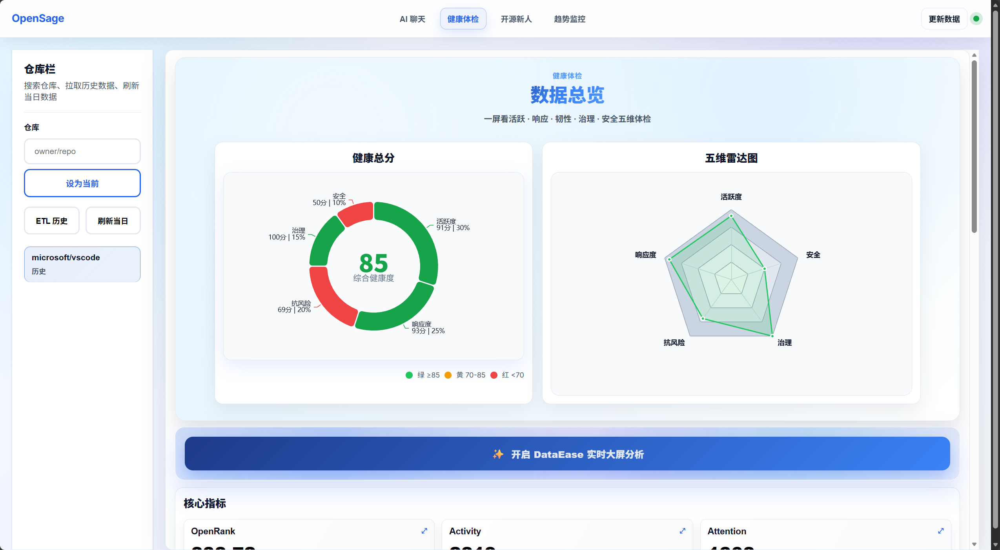
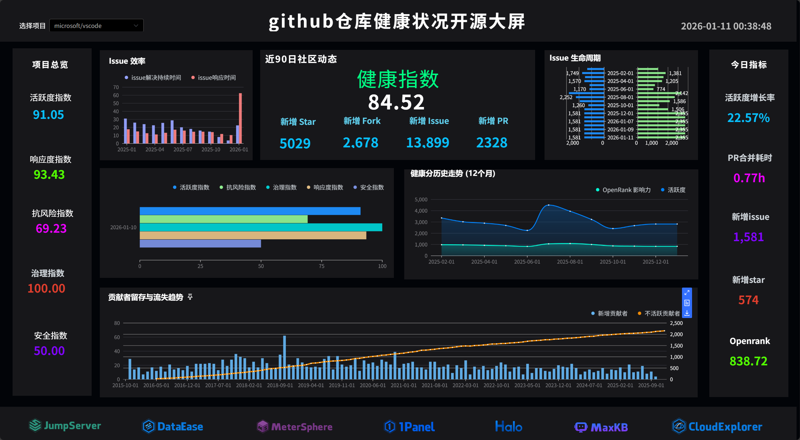
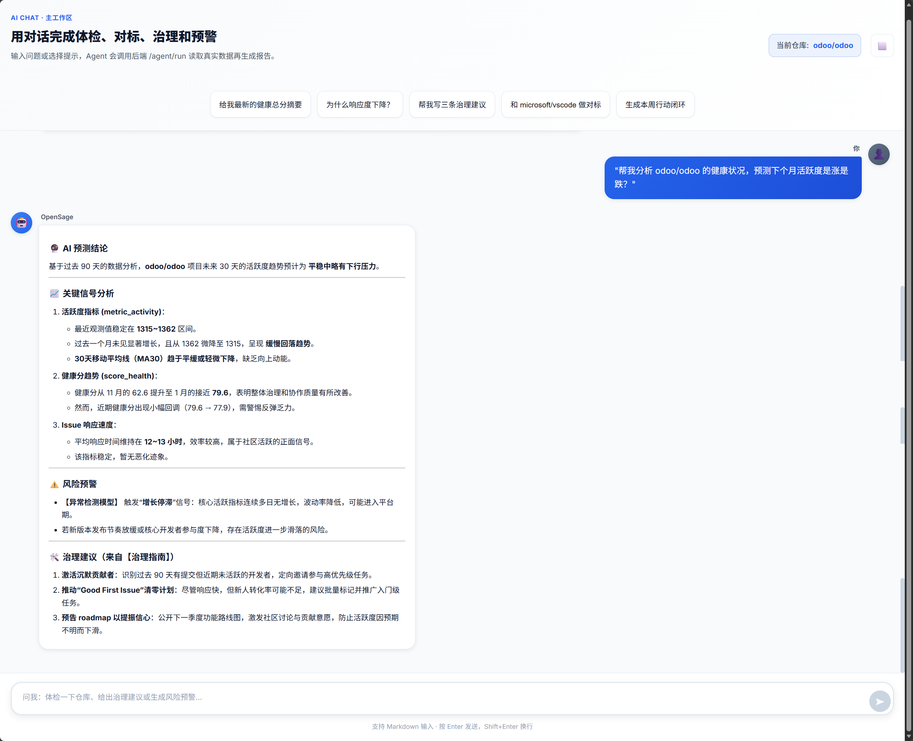
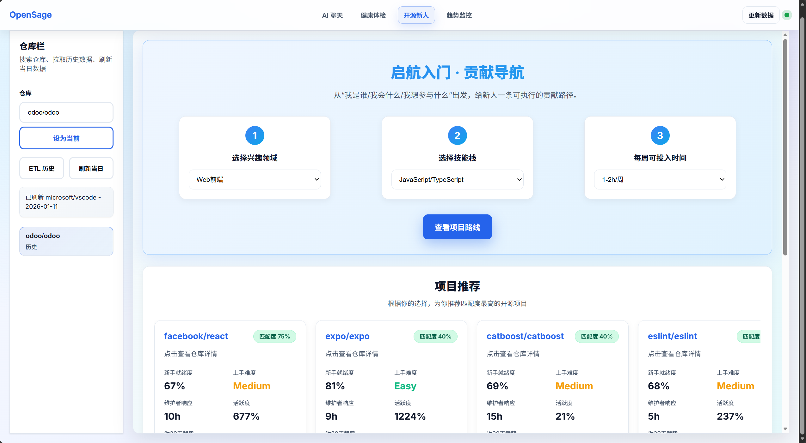
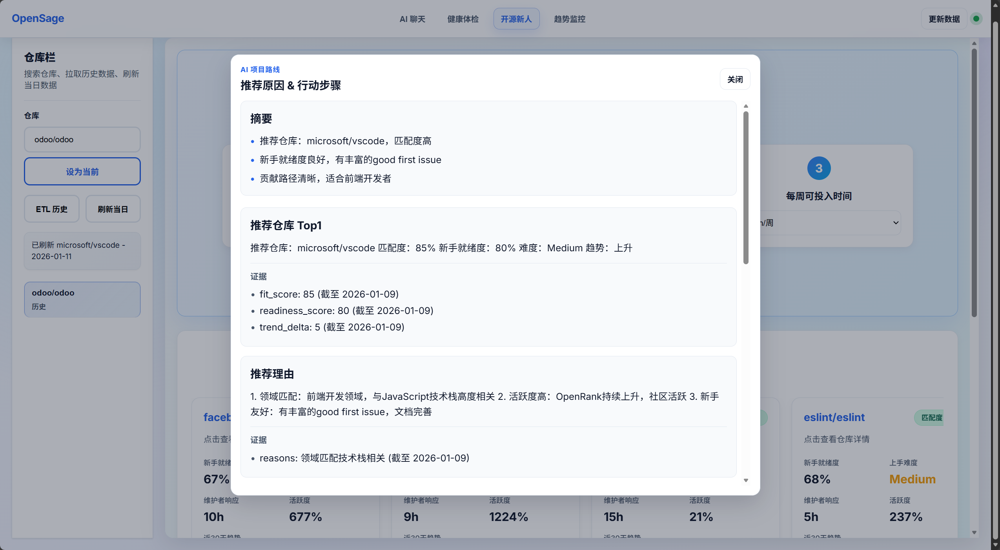
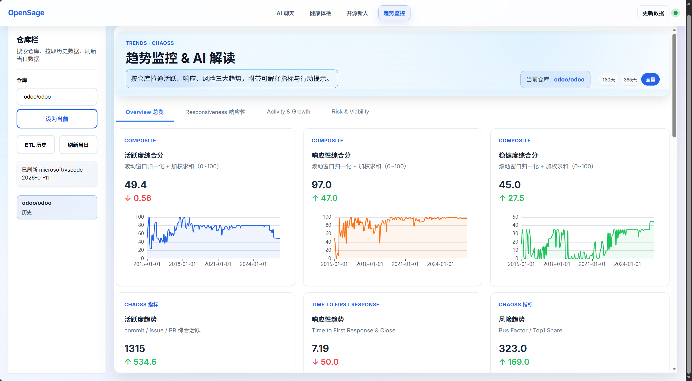
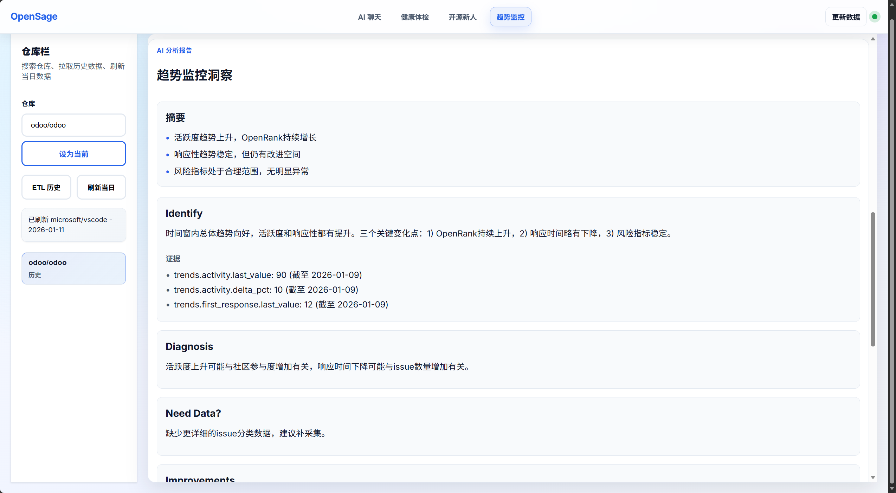

[](https://www.python.org/)
[](LICENSE)

# OpenSage 

## 目录

- [简介](#简介)
- [核心特性](#核心特性)
- [技术架构](#技术架构)
- [安装部署](#安装部署)
- [快速体验](#快速体验)
- [项目结构](#项目结构)
- [项目运行效果图](#项目运行效果图)
- [许可证](#许可证)

---

## 简介

OpenSage AI 是一个面向开源生态的 **一站式 AI Agent 综合体**。它将分散在 OpenDigger、GitHub、OpenSSF Scorecard 等多平台的孤立数据整合到同一条智能流水线中：用户只需自然语言提问，系统即可自动完成 **取数 → 清洗算分 → 分析洞察 → 生成报告 → 持续监控** 的全链路治理。

相比传统的数据看板，OpenSage 不仅提供数据，更强调“治理闭环”：从**Evidence**（数据证据）到**Prescription**（治理处方）再到**Track**（闭环追踪）。让开源治理从“凭感觉”走向“可量化、可执行”。

---
## 项目核心功能

### 1. 🩺 多维健康体检与 DataEase 可视化

基于独创的 **五维健康评分模型**，为项目提供全方位的“CT 扫描”。数据不仅以 JSON 形式返回，还直接对接 **DataEase** 大屏，生成可交互的健康度看板。

**五维评分模型权重与核心算法：**

$$ \text{HealthScore} = 0.30 V + 0.25 R + 0.20 Re + 0.15 G + 0.10 S $$

- **Vitality (活跃度 30%)**:  
  综合 OpenRank 影响力、Activity 活跃量（对数评分）、社区参与人数与增长率。

$$ \text{Score}\_V = \ln(1 + \text{OpenRank}) \times w_1 + \dots $$
- **Responsiveness (响应度 25%)**:  
  基于 **时间衰减函数** $T(h)$ 评估 Issue/PR 的首响时间、关闭周期与积压率。

$$ T(h) = \max(0, 100 \times \frac{\text{bad} - h}{\text{bad} - \text{good}}) $$
- **Resilience (韧性 20%)**:  
  结合 Bus Factor（总线因子）、贡献者多样性 (HHI 指数) 与留存率，评估项目抗风险能力。
- **Governance (治理 15%)**:  
  检查 README/LICENSE/Contributing 等文档完整度及社区流程透明度。
- **Security (安全 10%)**:  
  集成 OpenSSF Scorecard 标准，评估项目安全水位。

[📚 查看完整健康分算法文档](knowledge_base/Health_Score_Algorithm.md)

### 健康体检数据总览效果图



### Dataease数据大屏效果图


### 2. 🤖 OpenSage 智能对话与实时洞察

无需学习复杂的 SQL 或指标定义，直接像咨询专家一样提问。Agent 引擎会自动理解意图、调度工具链、生成图文并茂的分析报告。

- **多模态输出**：结论 + 证据卡 (Evidence Card) + 趋势图 + 治理建议。
- **ReAct 闭环**：Reason(意图拆解) → Act(工具调度) → Observe(数据校验) → Reflect(生成处方)。
- **典型场景**：
  > "对比 Vue 和 React 最近三个月的活跃度趋势"
  > "帮我分析一下 pytorch 目前存在的安全风险"

### OpenSage 对话示例效果图


### 3. 🌱 开源新人个性化导航 (Onboarding)

专为开源新手设计的推荐引擎，解决“想贡献但不知道选哪个项目、做什么任务”的痛点。

- **算法驱动推荐**：
  基于用户的 **技术栈**、**时间投入** 与 **兴趣领域**，结合项目的 **Readiness Score**（新人准备度），计算最佳匹配度。

$$ \text{Match} = 0.55 \times \text{Fit} + 0.45 \times \text{Readiness} $$
- **可执行任务清单**：
  自动挖掘项目中的 `good_first_issue` 或 `help_wanted` 任务，并生成定制化的 **Onboarding Checklist**（环境搭建、文档阅读、测试运行），帮助新人将 Ready-to-Code 时间缩短至周级别。

[📚 查看完整推荐算法文档](knowledge_base/Recommendation_Algorithm.md)

### 开源新人项目个性化推荐板块效果图



### 4. 📈 趋势分析与风险预警

不只看现状，更看未来。系统对历史时序数据进行统计分析，识别演变方向并预警潜在风险。

- **趋势判定算法**：
  使用 **最小二乘法 (Least Squares)** 线性回归计算关键指标（如 OpenRank、响应时间）的斜率 $k$，判定 Rising/Falling 趋势。

$$ k = \frac{N \sum xy - \sum x \sum y}{N \sum x^2 - (\sum x)^2} $$
- **异常检测**：
  基于 **Z-Score** 识别数据突变，结合业务阈值（如 "PR 首响 > 48h"、"Top1 份额 > 50%"）自动触发风险提示。
- **可视化报告**：
  生成包含趋势解读、异常点诊断和改进建议的综合治理报告。

[📚 查看完整趋势分析算法文档](knowledge_base/Trend_Analysis_Algorithm.md)

### 趋势监控及Agent分析板块效果图


---

## 技术架构

OpenSage 采用 **四层智能架构设计**，实现从自然语言输入到治理闭环的端到端流转。

### 1. 用户交互层

- **Frontend**: Vite + React 提供流畅的聊天界面与 Web 可视化。
- **Interaction**: 支持自然语言多轮对话与 DataEase 内嵌大屏展示。

### 2. AI Agent 引擎层

- **Orchestrator**: 基于 BERT + LLM 的意图理解与任务编排。
- **MetricEngine**: 核心算分引擎，负责数据清洗、归一化与五维健康分计算。
- **Planner**: 智能路由调度，根据任务类型选择最短工具路径（实时查询 vs 预计算）。
 - **OnboardingEngine**: 面向开源新人，计算 `Match = 0.55×Fit + 0.45×Readiness`，生成个性化推荐与任务清单（good_first_issue / help_wanted）。
 - **TrendMonitor**: 针对 OpenRank/活跃度/响应时间等关键时序指标执行趋势判定（最小二乘斜率 k）与异常检测（Z-Score），输出风险预警与阈值建议。

### 3. 工具与数据层

- **Tools Integrations**:
  - **OpenDigger**: 核心指标数据源。
  - **GitHub API**: 社区治理档案与实时 Issue 状态。
  - **OpenSSF Scorecard**: 安全评分数据。
  - **DataEase**: BI 可视化大屏渲染。
  - **MaxKB**: 知识库/知识增强（策略库、解释库、SOP 模板）。
- **Storage Strategy (四级缓存)**:
  - **Memory/Redis**: 热点查询秒级响应。
  - **IoTDB**: 海量历史时序数据存储，支持趋势分析。
  - **PostgreSQL**: 业务数据、快照与冷数据归档。

### 4. 输出层

- 图文报告：生成结构化的分析报告与治理结论，支持 Markdown/HTML 输出。
- 可视化图表：趋势、对标、雷达等图表，可嵌入 Web 或 DataEase 大屏。
- 可执行建议：结合 Evidence Card 输出治理“处方”，含任务清单与阈值建议。
- 实时预警：监控关键指标变化，触发告警并用于追踪闭环。

---

## 安装部署

### 环境要求

- Windows 10/11（建议）
- Docker Desktop（用于 PostgreSQL）
- Python 3.10+（后端）
- Node.js 18+ 与 npm（前端 ui-react）

### 1) 启动数据库

```bash
docker compose -f docker-compose.db.yml up -d
```

### 2) 启动后端（FastAPI）

```bash
cd backend
python -m venv .venv
.venv\Scripts\activate
python -m pip install -U pip setuptools wheel
pip install -r requirements.txt
python -m uvicorn app.main:app --reload --host 0.0.0.0 --port 8000
```

可选（存在时）：

```bash
backend\run_dev.bat
```

### 3) 启动前端（ui-react）

```bash
cd ui-react
npm install
npm run dev
```

前端预览：http://127.0.0.1:5173/

### 4) 一键容器（可选）

```bash
docker compose up -d
```

停止并清理：

```bash
docker compose down
```

---

## 快速体验

- 健康检查：GET http://127.0.0.1:8000/health
- 指标/预测/告警/组合：见 backend/app/api 下的路由（metrics.py、forecast.py、monitor.py、portfolio.py）。
- 图分析（可选）：backend/app/api/graph.py。

---

## 项目结构

```text
OpenSage/
├── README.md                  # 项目说明与使用指南
├── LICENSE                    # MIT 许可证
├── Makefile                   # 快速启动/演示/停止的 make 任务
├── docker-compose.yml         # 后端/数据库等服务编排
├── docker-compose.db.yml      # 仅数据库（PostgreSQL）编排
├── image/                     # 项目截图资源（README 展示）
├── knowledge_base/            # 算法与方法论文档
│   ├── Health_Score_Algorithm.md         # 五维健康度算法说明
│   ├── Recommendation_Algorithm.md       # 新人推荐算法说明
│   └── Trend_Analysis_Algorithm.md       # 趋势分析算法说明
├── dashboards/                # DataEase 数据集与说明
│   ├── README.md                          # 大屏集成说明
│   └── datasets/
│       ├── kpi_cards.sql                  # 关键指标卡片数据集
│       ├── top10_attention.sql            # Top10 关注度榜单数据集
│       ├── top10_growth.sql               # Top10 增长榜单数据集
│       └── trend_metric.sql               # 趋势监控相关数据集
├── data/                      # 演示数据与缓存
│   ├── demo_portfolio.json               # 示例组合数据
│   ├── repo_catalog_seed.csv            # 项目目录种子数据
│   ├── cache/                            # 运行时缓存目录
│   └── pg_data/                          # PostgreSQL 数据目录
├── frontend/                  # 轻量静态前端（可选）
│   ├── index.html                        # 静态首页
│   ├── package.json                      # 前端依赖清单
│   └── package-lock.json                 # 依赖锁定文件
├── scripts/                   # 初始化与演示脚本
│   ├── import_seed.sh                    # 导入种子数据脚本
│   ├── run_demo.sh                       # 演示环境一键运行
│   └── setup_db.sh                       # 初始化数据库脚本
├── backend/                   # FastAPI 后端 + Agent 引擎
│   ├── Dockerfile                          # 后端镜像构建脚本
│   ├── requirements.txt                    # Python 依赖清单
│   ├── repos.txt                           # 监控/分析的仓库列表
│   ├── run_dev.bat                         # Windows 本地开发启动
│   ├── run_dev.sh                          # Linux/macOS 本地开发启动
│   └── app/
│       ├── __init__.py                        # 包初始化
│       ├── main.py                          # 应用入口（路由注册、启动钩子）
│       ├── registry.py                      # 组件注册/工厂
│       ├── api/               # 业务接口层
│       │   ├── __init__.py                   # API 包初始化
│       │   ├── agent.py                      # Agent 路由（任务编排入口）
│       │   ├── ai.py                         # AI 服务路由（生成/分析）
│       │   ├── api.py                        # API 聚合/公共路由
│       │   ├── chat.py                       # 对话接口（聊天/问答）
│       │   ├── dataease.py                   # DataEase 集成路由
│       │   ├── forecast.py                   # 预测模块占位路由（/api/todo）
│       │   ├── graph.py                      # 图分析占位路由（/api/todo）
│       │   ├── health.py                     # 健康检查（/health）
│       │   ├── health_overview.py            # 健康概览查询路由
│       │   ├── iot_api.py                    # IoTDB 相关接口
│       │   ├── metrics.py                    # 指标查询/聚合路由
│       │   ├── monitor.py                    # 监控占位路由（/api/todo）
│       │   ├── newcomer.py                   # 新人推荐/行动计划路由
│       │   ├── portfolio.py                  # 组合占位路由（/api/todo）
│       │   ├── risk_viability.py             # 风险韧性指标路由
│       │   └── trends.py                     # 趋势分析路由
│       ├── core/              # 基础设施（配置、日志）
│       │   ├── __init__.py                   # 包初始化
│       │   ├── config.py                     # 配置加载与常量
│       │   └── logging.py                    # 日志初始化
│       ├── db/                # 数据访问层
│       │   ├── __init__.py                   # 包初始化
│       │   ├── base.py                       # 会话/依赖注入（SQLAlchemy）
│       │   ├── init_db.py                    # 数据库初始化钩子
│       │   ├── models.py                     # ORM 模型（HealthOverviewDaily 等）
│       │   └── migrations/                   # 迁移脚本目录
│       ├── jobs/              # 定时任务（APScheduler）
│       │   └── __pycache__/                  # 编译缓存
│       ├── models/            # 业务领域模型
│       │   ├── __init__.py                   # 包初始化
│       │   ├── repo_catalog.py               # 仓库目录实体
│       │   ├── repo_docs.py                  # 仓库文档实体
│       │   └── repo_issues.py                # 仓库 Issue 实体
│       ├── schemas/           # Pydantic 模式
│       │   ├── __init__.py                   # 包初始化
│       │   ├── agent.py                      # Agent 请求/响应模型
│       │   ├── output_schema.py              # 标准输出结构定义
│       │   └── requests.py                   # 通用请求参数模型
│       ├── services/          # 服务编排与计算
│       │   ├── __init__.py                   # 包初始化
│       │   ├── agent_runtime.py              # Agent 运行时封装
│       │   ├── ai_service/                   # AI 生成/验证/模板
│       │   │   ├── cache.py                  # AI 结果缓存
│       │   │   ├── facts/                    # 事实卡片计算
│       │   │   │   ├── health_facts.py       # 健康度事实汇总
│       │   │   │   ├── newcomer_facts.py     # 新人推荐事实汇总
│       │   │   │   └── trend_facts.py        # 趋势分析事实汇总
│       │   │   ├── render/                   # 渲染器
│       │   │   │   └── markdown.py           # Markdown 渲染
│       │   │   ├── templates/                # 提示词模板
│       │   │   │   ├── system_prompt.txt     # 系统提示词
│       │   │   │   ├── health_prompt.txt     # 健康度分析提示词
│       │   │   │   ├── health_system_prompt.txt # 健康度系统提示词
│       │   │   │   ├── newcomer_prompt.txt   # 新人推荐提示词
│       │   │   │   └── trend_prompt.txt      # 趋势分析提示词
│       │   │   └── validators/               # 输出校验
│       │   │       ├── schema.py             # 输出 Schema 校验
│       │   │       └── evidence_check.py     # 证据卡一致性校验
│       │   ├── bootstrap_service.py          # 初始化/引导服务
│       │   ├── compare.py                    # 对比分析服务
│       │   ├── composite_metrics.py          # 复合指标计算
│       │   ├── evidence.py                   # 证据卡生成
│       │   ├── github_fetch.py               # GitHub 数据抓取
│       │   ├── governance.py                 # 治理评分计算
│       │   ├── health_pipeline.py            # 健康度管线编排
│       │   ├── health_refresh.py             # 健康度刷新作业
│       │   ├── iotdb_service.py              # IoTDB 服务封装
│       │   ├── metric_engine.py              # 算分引擎
│       │   ├── metrics.py                    # 指标组合/聚合
│       │   ├── monitor.py                    # 监控服务
│       │   ├── newcomer_plan.py              # 新人行动计划生成
│       │   ├── newcomer_scoring.py           # 新人准备度与匹配度
│       │   ├── orchestrator.py               # 任务编排器
│       │   ├── portfolio.py                  # 组合建议生成
│       │   ├── recommend.py                  # 推荐策略
│       │   ├── report.py                     # 报告生成
│       │   ├── router.py                     # 动态路由编排
│       │   └── snapshot.py                   # 快照落库
│       ├── skills/            # Agent 技能插件
│       │   ├── __init__.py                   # 包初始化
│       │   ├── advisor.py                    # 治理顾问技能
│       │   └── base.py                       # 技能基类
│       └── tools/             # 外部服务客户端
│           ├── __init__.py                   # 包初始化
│           ├── dataease_admin_client.py      # DataEase 管理端 API 客户端
│           ├── dataease_client.py            # DataEase 普通 API 客户端
│           ├── github_client.py              # GitHub API 客户端
│           └── opendigger_client.py          # OpenDigger 指标 API 客户端
├── ui-react/                  # 前端（React + Vite）
│   ├── index.html                        # 应用入口 HTML
│   ├── package.json                      # 前端依赖清单
│   ├── vite.config.js                    # Vite 构建配置
│   ├── README.md                         # 前端项目说明
│   └── src/
│       ├── App.jsx / App.css             # 根组件与样式
│       ├── main.jsx / index.css          # 入口脚本与全局样式
│       ├── pages/
│       │   └── TrendMonitor.jsx          # 趋势监控页面
│       └── service/
│           └── api.js                    # 前端 API 封装
└── frontend/                  # 另一个轻量前端（可选）
  ├── index.html                        # 静态页面
  ├── package.json                      # 依赖清单
  └── package-lock.json                 # 依赖锁定
```

---

## 许可证

本项目采用 MIT 许可证，详见 LICENSE。